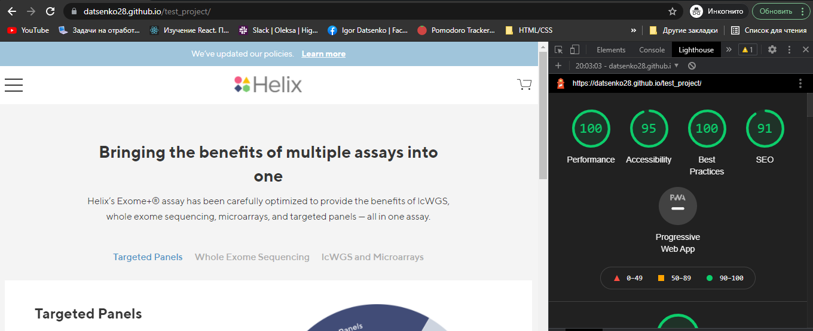
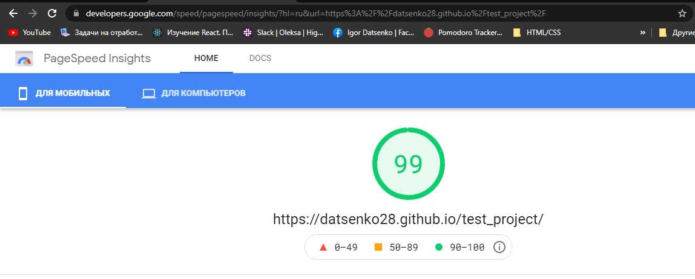
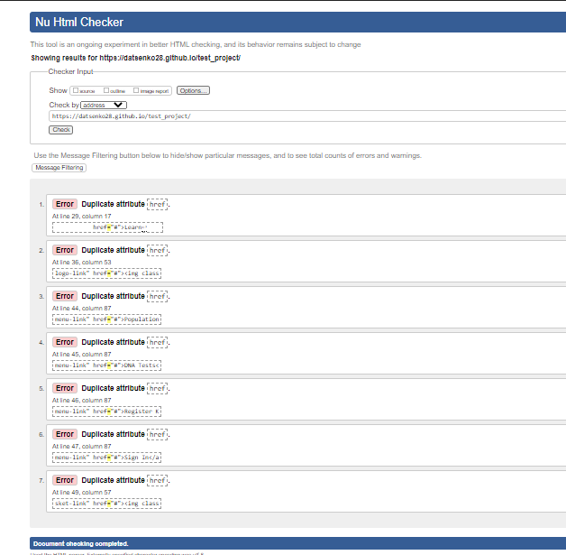

#[Test Task](https://docs.google.com/document/d/1T-HmbZhnV2CWoT2SGzqDZ-bMhkk9OcpNFoW8R2Cvvow/edit)
stack : 

    HTML, CSS (SASS, BEM, Responsive), Javascript (jQuery)

[Zeplin link](https://app.zeplin.io/project/5afd41fefca4d6551d1de26d/screen/5f157c7bfab6d3067da5e34a)

### Lighthouse

###[Google speed](https://developers.google.com/speed/pagespeed/insights/?hl=ru&url=https%3A%2F%2Fdatsenko28.github.io%2Ftest_project%2F)

###[Validator w3](https://validator.w3.org/nu/?doc=https%3A%2F%2Fdatsenko28.github.io%2Ftest_project%2F)
